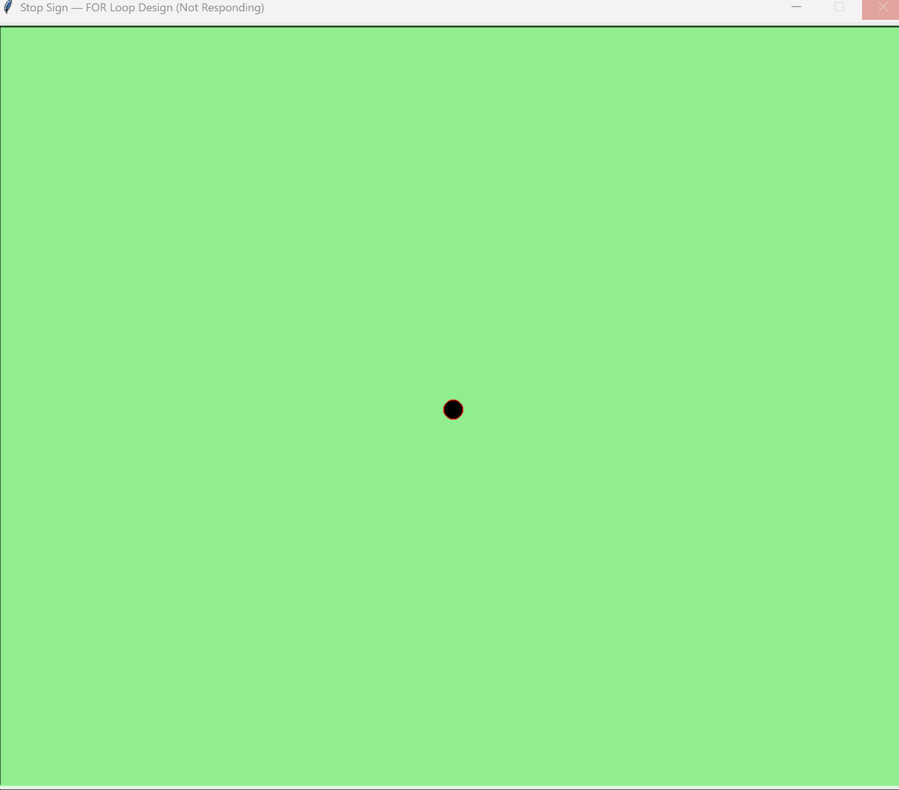
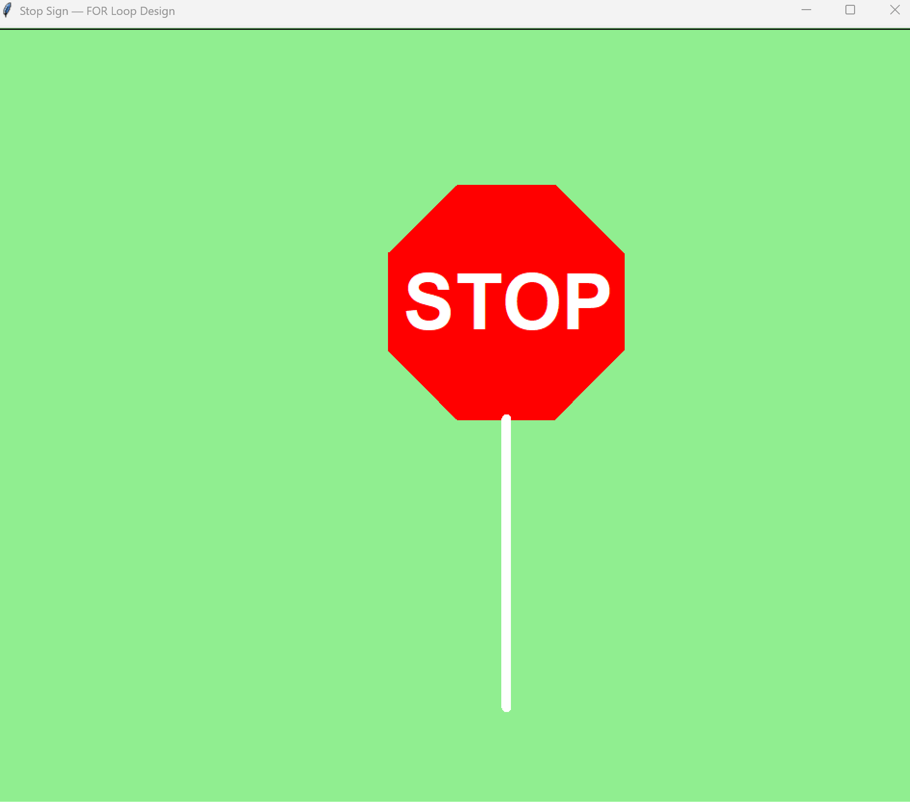

# 🛑 Stop Sign — FOR Loop Graphic Design

A Python turtle graphics program that draws a stop sign shape
using a FOR loop. The user enters the number of sides, and the
program draws and fills the shape in red, writes "STOP" in white,
and adds a sign pole below the shape.

---

## 📋 Features

- Prompts the user to enter the number of sides for the shape
- Uses a `for` loop to draw each side
- Fills the shape red using `begin_fill()` and `end_fill()`
- Writes "STOP" in white bold text on the shape
- Draws a stop sign pole
- Prints the current count to the console during drawing

---

## ⚙️ How It Works

1. The user enters the number of sides
2. A `for` loop runs that many times drawing each side
3. The shape is filled with red
4. "STOP" is written in white on the shape
5. A pole is drawn below the shape

---

## 💡 Example Console Output

```
Enter the number of sides for the design: 8
count = 1
count = 2
count = 3
count = 4
count = 5
count = 6
count = 7
count = 8
```

---

## 🛠️ Technologies Used

| Technology     | Purpose                             |
|----------------|-------------------------------------|
| Python 3.14    | Core programming language           |
| `turtle`       | Drawing the graphic design          |
| `for` loop     | Repeating drawing steps             |
| `input()`      | Collecting user-defined side count  |
| Functions      | Organized drawing logic             |

---

## 🎓 Learning Outcomes

- Using a `for` loop with `range()` to repeat drawing steps
- Using `begin_fill()` and `end_fill()` to fill shapes with color
- Taking user input to control drawing behavior
- Using `goto()` to position the turtle at specific coordinates
- Writing text on the canvas using `write()`

---

## 📁 Folder Structure

```
A4-FOR-Loop-Design/
├── Fabrick_Marlena_A4_Design_FOR_LOOP_RV.py
├── A4-start.png
├── A4-finished.png
├── .gitignore
├── LICENSE
└── README.md
```

---

## 🚀 How to Run

### Prerequisites
- [Python 3](https://www.python.org/downloads/)

### Steps

```bash
python Fabrick_Marlena_A4_Design_FOR_LOOP_RV.py
```

---

## 📸 Screenshots

### Program Start — User Input



### Finished Design



## 👩‍💻 Author

**Marlena Fabrick** — Python turtle graphics student project
